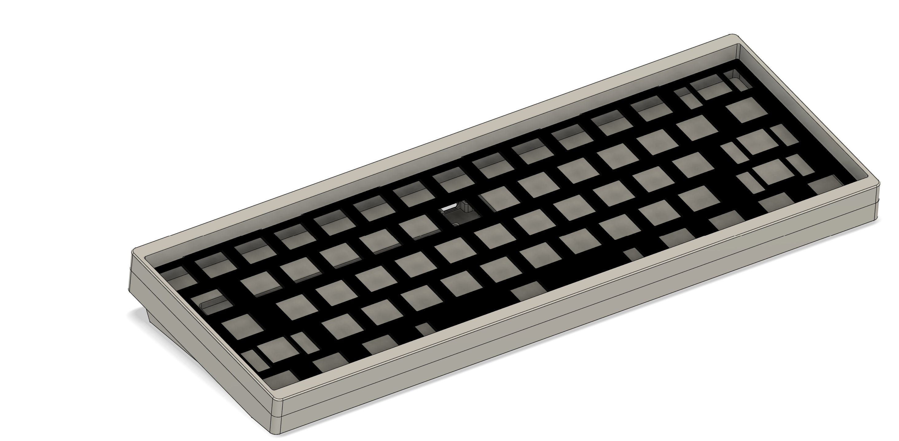
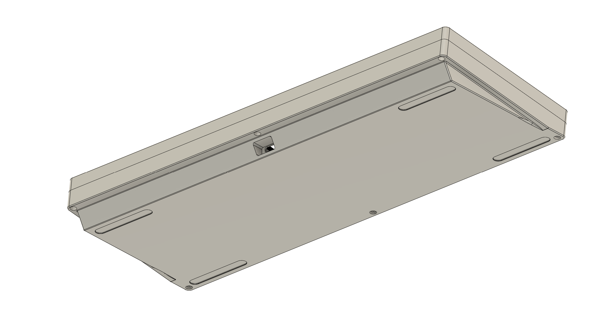
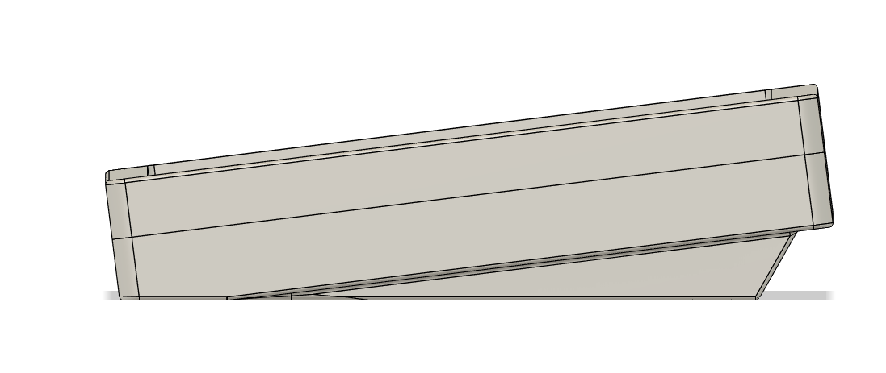

# Open60 (Name TBD)
 A standard 60% utilizing the H60 and Geon Tadpoles.
# Specs
* Mounting style: Geon Tadpole (Technically can also use gasket)
* Typing Angle: 7 Degrees
* Uses the Hiney 60
* Built Weight
* Front height: 18.5mm
* Uses SKUF 
* Screws required:
  * 6x M2 14mm: https://www.mcmaster.com/91290A045/
  * 4x M2 5mm
# Notes
* You don't have to, but please ask me before doing anything commercial with my design.
* This is designed for reference only and is untested, I will not take any responsiblity for issues that may occur.

